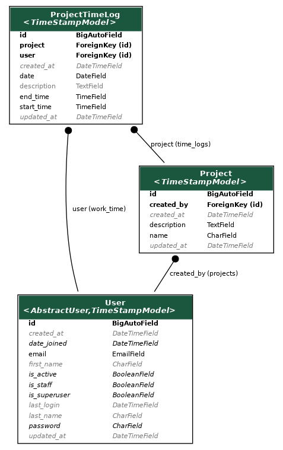

## Work Time Tracking Application

## About this project

A multi-user and multi-project work time tracking application using Django and Django Rest Framework.


**Project Dependencies:**

1. Python version 3.8.5
2. Other dependencies is mentioned in the requirements.txt file


**Developers Contact:**

Email: toobanaseer3@gmail.com


**To run this app locally:**

1. Clone the repository
   ```git clone <repository URL>```

2. Create a virtualenv
   ```python3 -m venv tracking-app-env```

3. Activate the virtual env
  ```source tracking-app-env/bin/activate```

4. Goto the directory where requirements.txt is present and install project dependencies using this command:
  ```pip install -r requirements.txt```

5. Using CLI, goto the directory where manage.py is present

6. Run database migrations using the following command:
   ```python manage.py migrate```

7. Run local server using this command:
    ```python manage.py runserver```


**Test Cases**

- Test coverage of over 90%.
- You can run the test cases using the ```python manage.py test``` command.


**APIs documentation using Postman**

[](https://www.getpostman.com/collections/ffb2565bf7682eaf157f)


## Database Design
-  This is relational database design 
- Models are defined in models.py file of each app



**Documentation**

- Code contains comments where needed
- APIs are documented in the postman. Link shared above.

**Code Formatting**

- Code is auto-formatted using black package.
